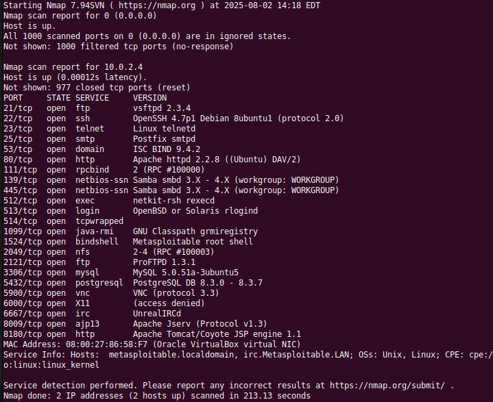

# Домашнее задание к занятию "`Уязвимости и атаки на информационные системы`" - `Лебедев Виктор`

### Инструкция по выполнению домашнего задания

   1. Сделайте `fork` данного репозитория к себе в Github и переименуйте его по названию или номеру занятия, например, https://github.com/имя-вашего-репозитория/git-hw или  https://github.com/имя-вашего-репозитория/7-1-ansible-hw).
   2. Выполните клонирование данного репозитория к себе на ПК с помощью команды `git clone`.
   3. Выполните домашнее задание и заполните у себя локально этот файл README.md:
      - впишите вверху название занятия и вашу фамилию и имя
      - в каждом задании добавьте решение в требуемом виде (текст/код/скриншоты/ссылка)
      - для корректного добавления скриншотов воспользуйтесь [инструкцией "Как вставить скриншот в шаблон с решением](https://github.com/netology-code/sys-pattern-homework/blob/main/screen-instruction.md)
      - при оформлении используйте возможности языка разметки md (коротко об этом можно посмотреть в [инструкции  по MarkDown](https://github.com/netology-code/sys-pattern-homework/blob/main/md-instruction.md))
   4. После завершения работы над домашним заданием сделайте коммит (`git commit -m "comment"`) и отправьте его на Github (`git push origin`);
   5. Для проверки домашнего задания преподавателем в личном кабинете прикрепите и отправьте ссылку на решение в виде md-файла в вашем Github.
   6. Любые вопросы по выполнению заданий спрашивайте в чате учебной группы и/или в разделе “Вопросы по заданию” в личном кабинете.
   
   Желаем успехов в выполнении домашнего задания.

---

Задание можно выполнить как в любом IDE, так и в командной строке.

### Задание 1

Скачайте и установите виртуальную машину Metasploitable: https://sourceforge.net/projects/metasploitable/.

Это типовая ОС для экспериментов в области информационной безопасности, с которой следует начать при анализе уязвимостей.

Просканируйте эту виртуальную машину, используя **nmap**.

Попробуйте найти уязвимости, которым подвержена эта виртуальная машина.

Сами уязвимости можно поискать на сайте https://www.exploit-db.com/.

Для этого нужно в поиске ввести название сетевой службы, обнаруженной на атакуемой машине, и выбрать подходящие по версии уязвимости.

Ответьте на следующие вопросы:

- Какие сетевые службы в ней разрешены?
- Какие уязвимости были вами обнаружены? (список со ссылками: достаточно трёх уязвимостей)
  
*Приведите ответ в свободной форме.*  

---

### Решение 1
Сканирование машины выявило следующие открытые сетевые службы

Ответьте на следующие вопросы:
Какие сетевые службы в ней разрешены?

FTP (vsftpd 2.3.4)
SSH (OpenSSH 4.7p1)
Telnet (Linux telnetd)
SMTP (Postfix smtpd)
DNS (ISC BIND 9.4.2)
HTTP (Apache httpd 2.2.8)
RPC (rpcbind 2)
NetBIOS (Samba smbd 3.X - 4.X)
Exec (netkit-rsh rexecd)
Java RMI (GNU Classpath grmiregistry)
Bind Shell (Metasploitable root shell)
NFS (2-4)
FTP (ProFTPD 1.3.1)
MySQL (MySQL 5.0.51a)
PostgreSQL (PostgreSQL 8.3.0 - 8.3.7)
VNC (protocol 3.3)
X11 (access denied)
IRC (UnrealIRCd)
AJP (Apache Jserv Protocol v1.3)
HTTP (Apache Tomcat/Coyote JSP engine 1.1)

Какие уязвимости были вами обнаружены? (список со ссылками: достаточно трёх уязвимостей)
<a href="https://www.exploit-db.com/exploits/49757">vsftpd 2.3.4 - Backdoor Command Execution</a>
<a href="https://www.exploit-db.com/exploits/6122">BIND 9.4.1 < 9.4.2 - Remote DNS Cache Poisoning (Metasploit)</a>
<a href="https://www.exploit-db.com/exploits/41974">RPCBind / libtirpc - Denial of Service</a>

---

### Задание 2

Проведите сканирование Metasploitable в режимах SYN, FIN, Xmas, UDP.

Запишите сеансы сканирования в Wireshark.

Ответьте на следующие вопросы:

- Чем отличаются эти режимы сканирования с точки зрения сетевого трафика?
- Как отвечает сервер?

*Приведите ответ в свободной форме.*

### Решение 2

---

